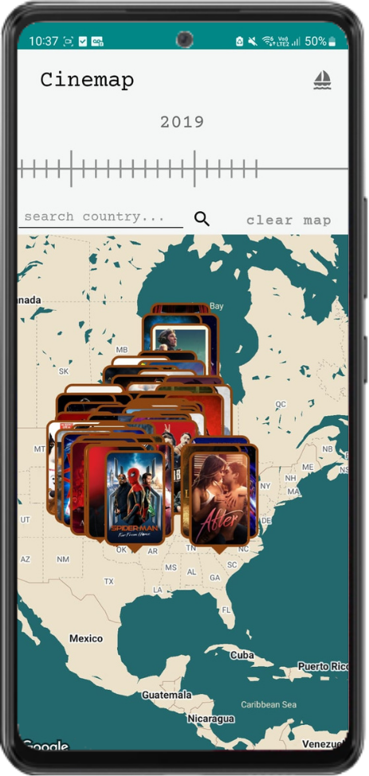
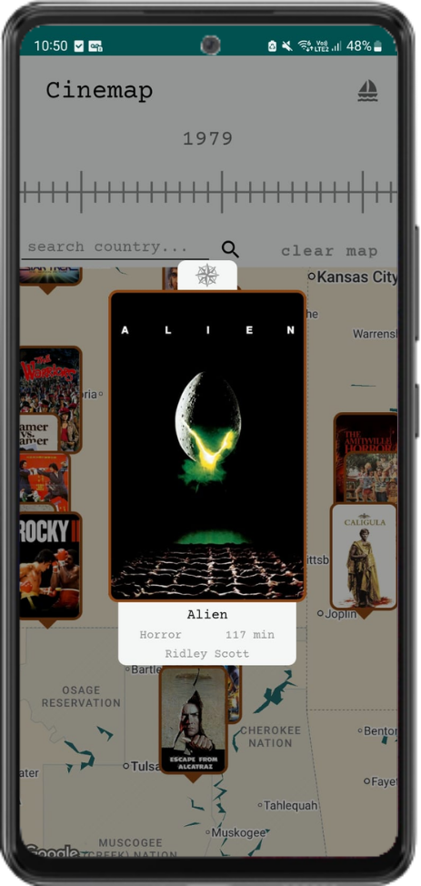

# 🎬 Cinemap
    
### Discover films through history and geography — An Android app for film explorers!
 From blockbuster hits to overlooked treasures from across the globe, navigate through world cinema.
 
   

---

## 🧭 Features

- **World Map Exploration** — Discover films by country.
- **Film Discovery by Year** — Explore films filtered by specific years.
- **Go to** — Find movies going to locations directly by searching a country, region or city.
- **Favorites** — Save your favorite finds for easy access later.
- **Exploration History** — Track your discovery journey across countries and time.
- **Nametags** — Unlock custom profile titles based on the number of saved films.

  Available in English, Portuguese, Spanish and French

---

## 📲 Try it on

### Requirements:

- Android 8.1 (API Level 27) or higher.

### Steps:

1. **Allow installation from unknown sources:**

   ```Settings > Security and privacy > Install unkwnown apps > Enable the permission in your preferred browser/app```

3. **Download the latest APK:**

    [Go to Releases](https://github.com/lucaslimb/cinemap/releases)  (Current version: **v1.0.0**)

---

## 🛠️ Tech Stack

- **Language:** Kotlin + xml
- **IDE:** Android Studio
- **Build Tool:** Gradle

### 📦 Main Libraries & Tools:

- [Retrofit2](https://square.github.io/retrofit/) – Networking
- [Glide](https://bumptech.github.io/glide/) – Image loading
- [Room](https://developer.android.com/jetpack/androidx/releases/room) – Local database
- [Google Maps SDK for Android](https://developers.google.com/maps/documentation/android-sdk/overview) – Map visualization
- [TMDB API](https://developer.themoviedb.org/docs/getting-started) – Movie data source

---
